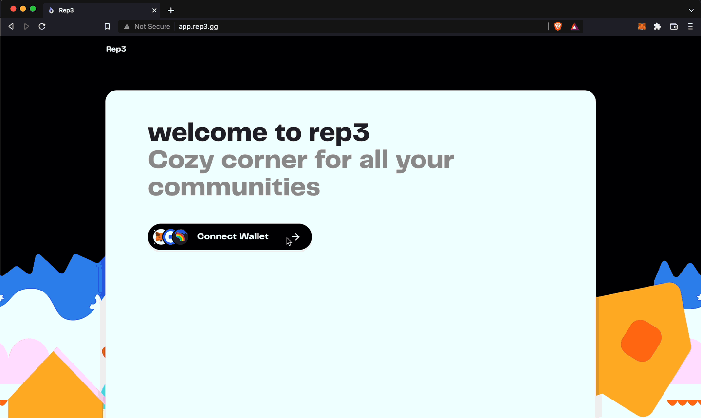

# Onboarding Your Community
Before we define our membership levels and distribute membership badges, we must onboard your community on the rep3 platform. This is pretty straightforward:

#### 1. Visit the [rep3 webapp](https://app.rep3.gg/) and connect your wallet.

#### 2. Select the checkbox if you plan to use rep3 for payouts. 
This can be done later as well.

#### 3. Add your community details like its name and logo.

#### 4. Add the approvers / admins of the community, and we're set!
The accounts added here shall get admin privileges and will be able to setup and distribute membership and contribution badges, create new types of badges, edit membership levels and upgrade or downgrade the membership level of a member. Admins can be added or removed later as well.

Now let's setup our membership badges and give them to our members.