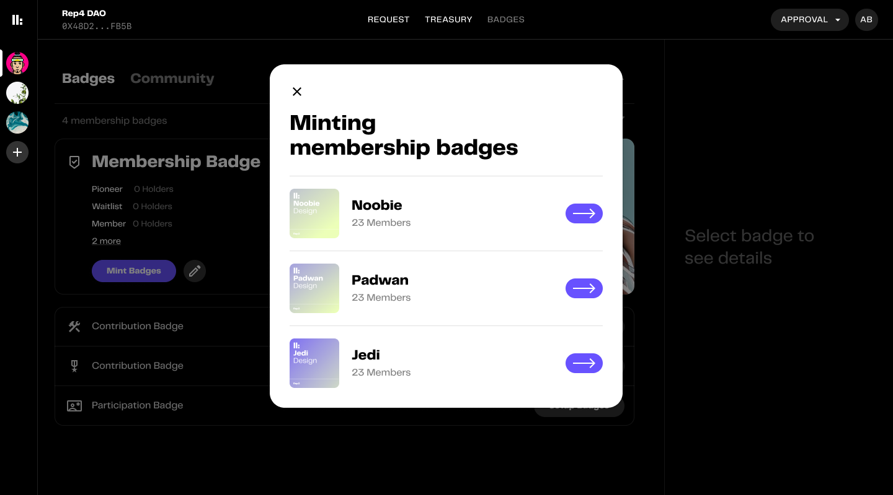
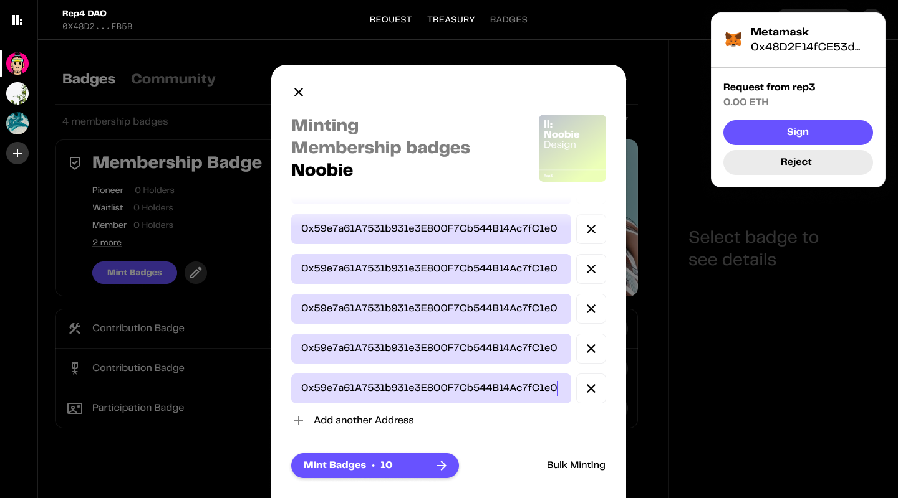
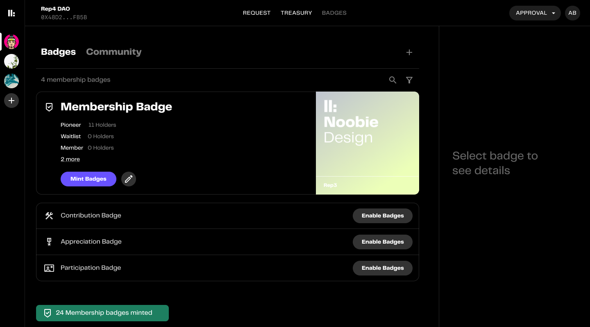

#  Approving membership

This sections covers the guide to approve memberships on EOAs

1. Select the badge type to mint. Here we will be going with Membership badges

2. Select the membership

3. Add addressess and sign the voucher

:::note Note

Other methods for bulk upload like csv upload can also be used here

:::

:::caution Caution

You can only approve maximum of 25 addresses in a single voucher. For bulk approving more than 25 please [contact us](http://discord.gg/xK2WXUv3VG)

:::

4. Done! Next up claiming a membership

