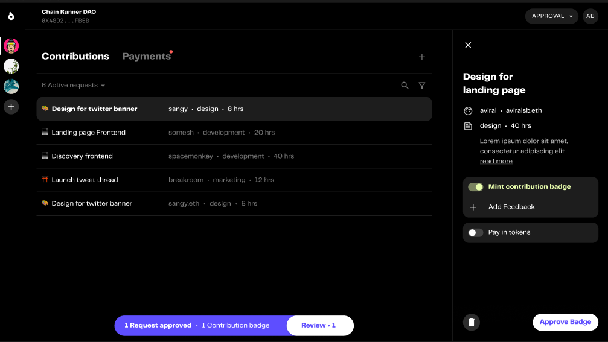
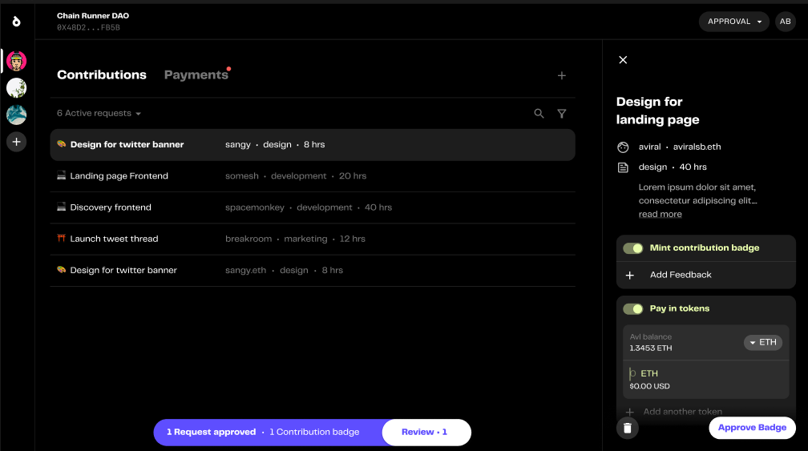
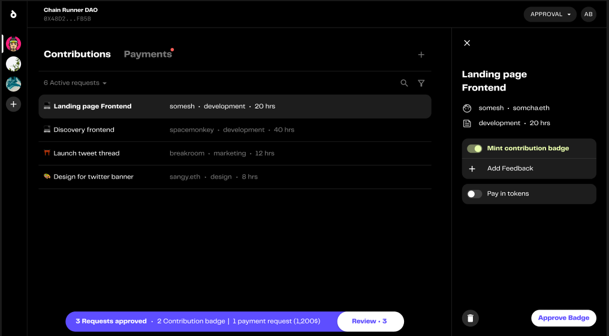
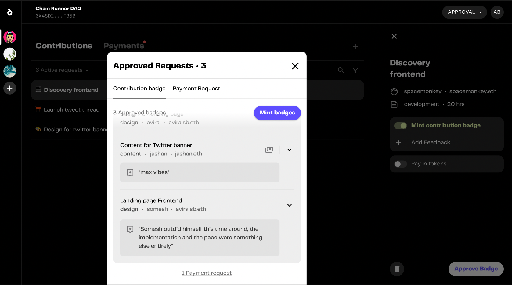

# Approving contributions

This sections covers the guide for approvers to approve contribution badges and payouts

1. Select the contribution from dashboard to approve

2. Enter details for badge and payout

3. Approve badge, it'll start appearing in the section at the bottom. All approved badges can be accessed from the bottom section

4. Enter details, sign and approve badge and sign payout

