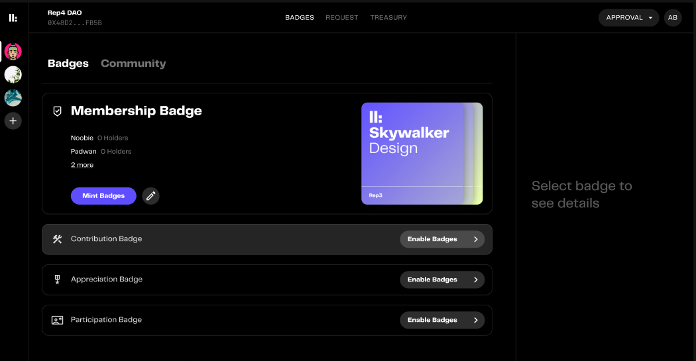
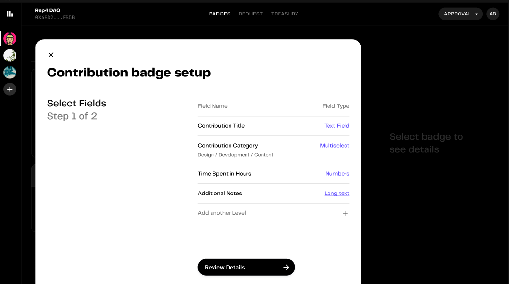
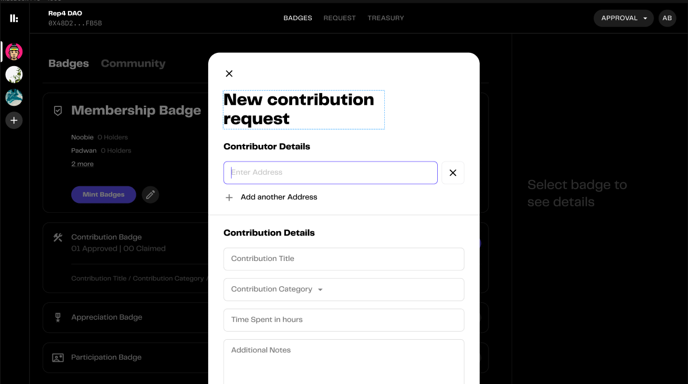
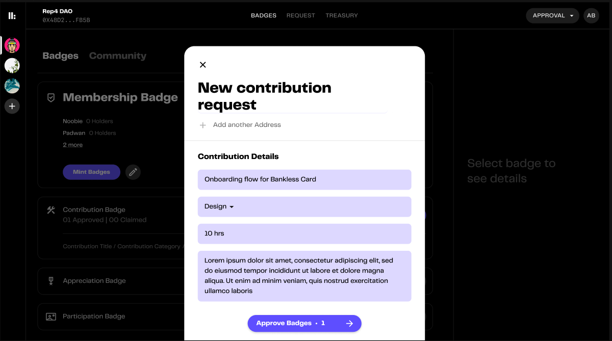

# Setting Up

This sections covers the guide to activate and enable contribution badges

#### Enabling the contribution badges

1. Click on enable contribution badge

2. Edit fields and titles

3. Review

4. And done. Community can mint contribution badges for the contributors

#### Issuing contributor badges

5. Enter contributor addresses. (Address should have a membership token associated)

6. Fill out the details.

7. Sign and done. Contributor can now claim the contribution badge.

