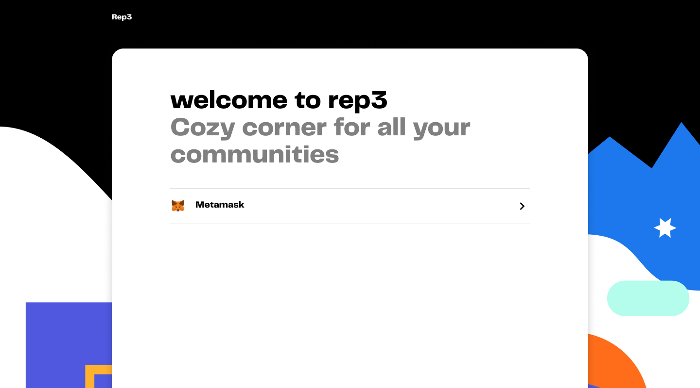
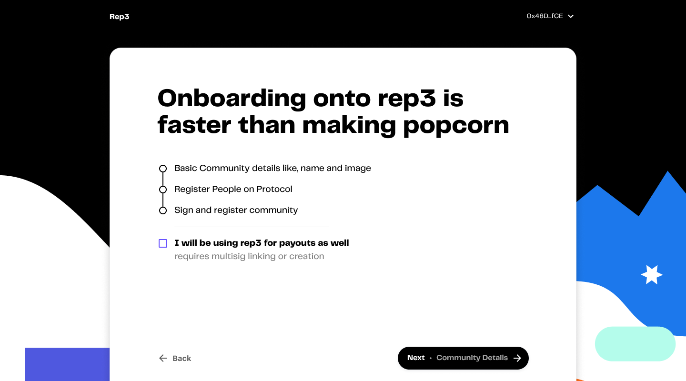
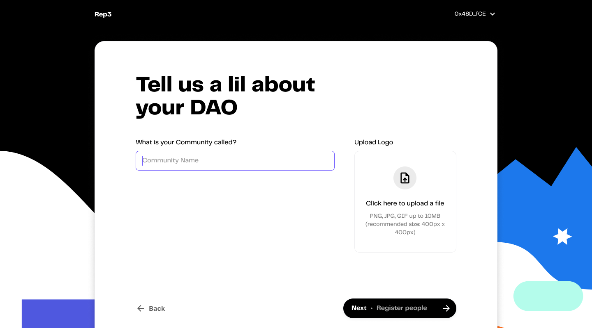
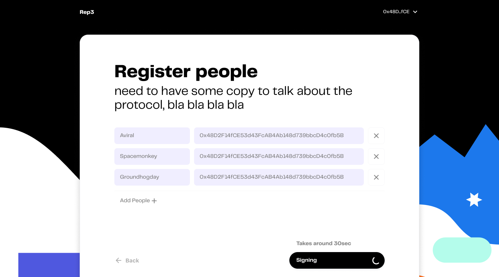
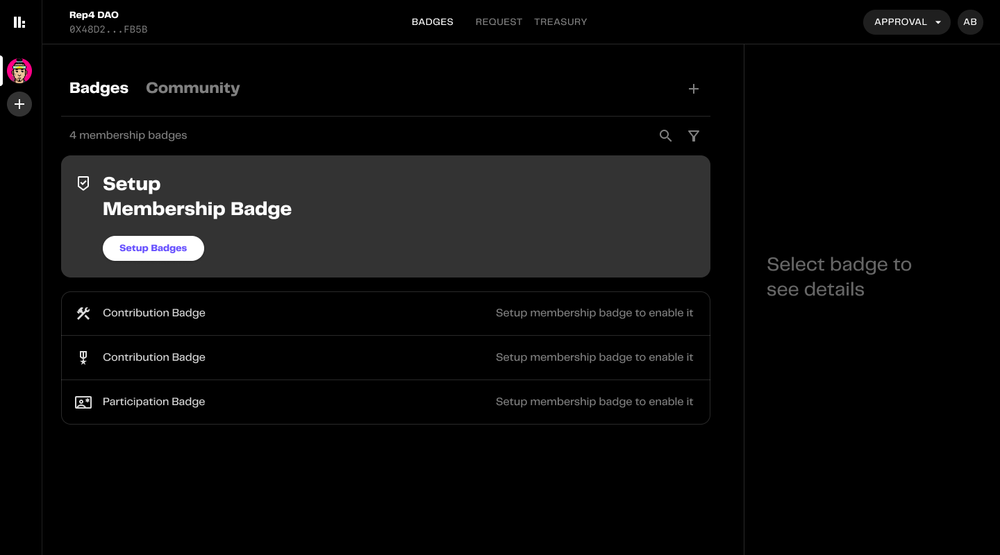
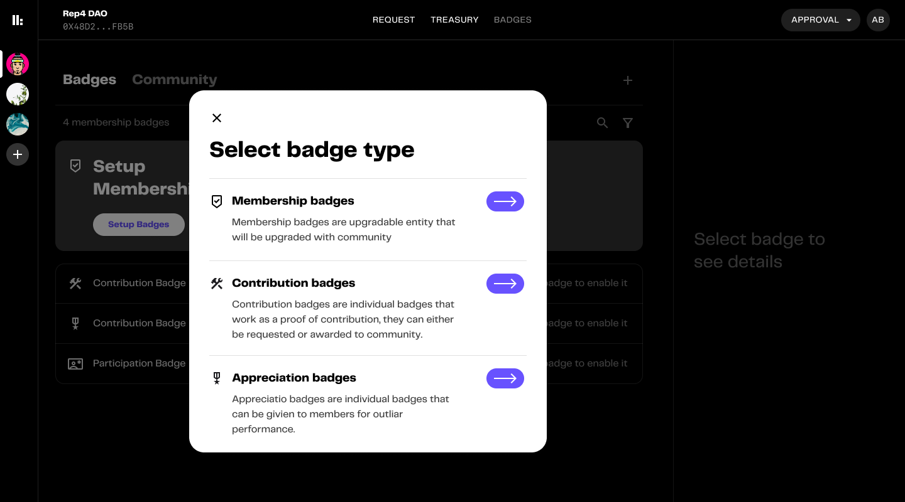
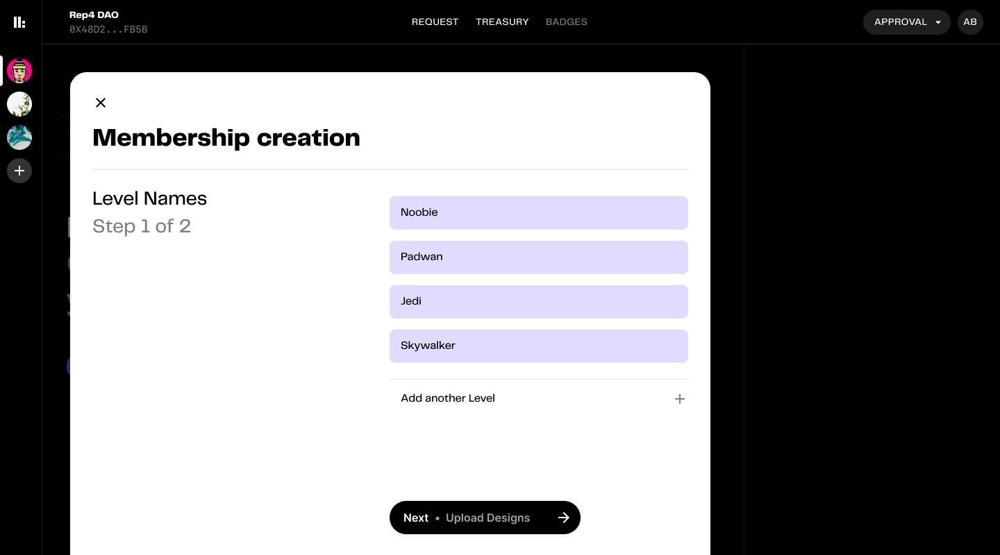
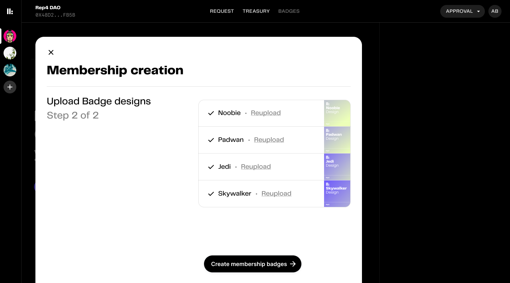
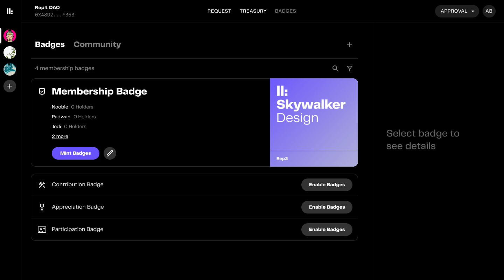

# ⚙️ Setting up

This sections covers the guide to register a community on rep3 via rep3 hub and create memberships

#### Registering the community with approvers

1. Login via metamask

2. Select the checkbox if the community plans to use payouts as well

3. Enter community name and upload community logo

4. Enter names (or aliases) and addresses of the approvers. Approvers will be able to approve badges for members in a community.

Approvers can be added or removed at later stages as well.

5. And done. Next up setting up membership badges

#### Creating the membership tokens

6. Select the the type of badge you want to create. Here we'll be creating memberships.

7. Enter the membership names.

8. Upload the badge images for the memberships.

9. Done! Next up approving memberships and creating a signed voucher.

