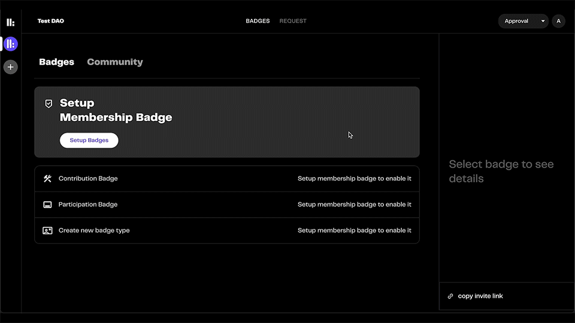

# Badge Autoclaim

Organising your community is fairly straightforward if you use Discord. In fact,  most communities that use Discord are already well organised through server roles.

Now, you can supercharge your server roles and automate badge disbursal using the rep3 Discord bot. Our badge autoclaim feature takes out the manual work from tokenizing memberships -- you no longer need to keep track of Discord IDs, wallet addresses and roles in spreadsheets.

This feature is most useful for communities that have a large number of Discord members. Follow along to bring your community on-chain within minutes.

#### 1. Setup membership badges.
Assuming you have [onboarded your community](https://docs.rep3.gg/memberships/setting-up-memberships), you need to first [setup membership badges](https://docs.rep3.gg/memberships/approving-memberships#1-setup-membership-badges) on the rep3 platform and specify the different levels of membership in your community.

#### 2. Enable autoclaim and invite the bot to your server.
Next, you need to enable autoclaim and connect your Discord account with the rep3 platform. After giving the relevant permissions and choosing your community server, the rep3 Discord bot will automatically arrive in the server.

#### 3. Map membership levels to server roles.
Here you need to specify the server role that corresponds to each membership level. In our example below, there are three membership levels in the membership badge, which coincide with the server roles in our Discord server.

#### 4. Claiming a membership badge this way.
And we're done! Now, you simply need to copy the invite link and share it with your members. They shall automatically receive their membership badge with the relevant level when they click on the link and connect their Discord.

In this way, you can easily disburse membership badges to your community members and give them the correct levels without much manual work (if any at all!) 😄