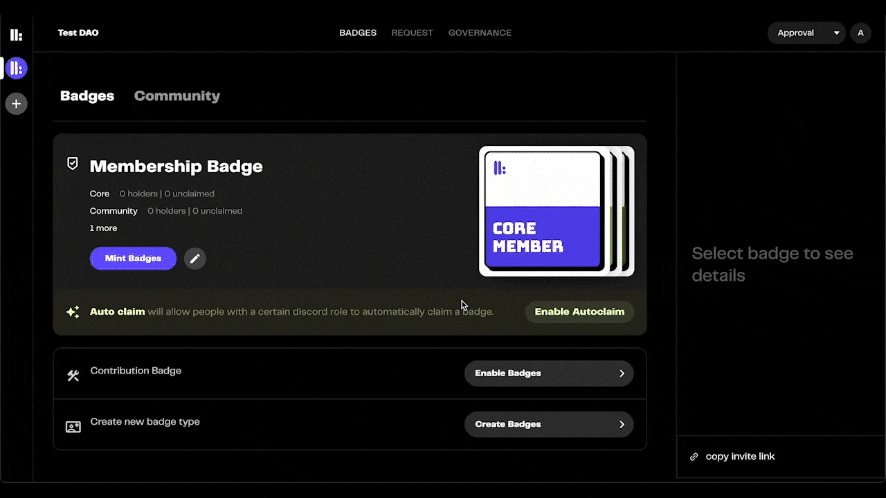

# Snapshot Integration

While credentials can greatly reduce the burden of running a community, their true power lies in the applications they enable. Contextual governance is a prime example of this.

It is a system where different people have different voting powers based on their expertise or contributions to the community. This is super easy to implement in communities that effectively use credentials.

In the rep3 platform, we've made it possible to implement contextual governance in just six steps using our simple interface.

#### 1. Switch to the `Governance` tab.
After setting up your badges, switch to the `Governance` tab from the top of the screen.

#### 2. Edit the number of votes per badge.
Here you can specify the number of votes per badge of a specific tier. In the example below,

one vote of a *Core Member* equals `3 * 1`  = `3` votes,

one vote of a *Community Member* equals `2 * 1` = `2` votes, and 

one vote of an *Early Supporter* equals `1 * 1` = `1` vote.

#### 3. Optionally, you can also include token-holdings in this calculation.

In addition to having a multiplier based on membership tiers, you can have another multiplier based on the number of tokens held by a member. Let's understand this via an example.

Imagine three members of SampleDAO. Let's call them Alice, Bob and Chandler. Alice is a *Core Member* with `14 $SAMPLE`. Bob is a *Community Member* with `9 $SAMPLE`. And Chandler is an *Early Supporter* with `25 $SAMPLE`. So, 

Alice's vote actually equals `3 * 14 * 1` = `42` votes, 

Bob's vote equals `2 * 9 * 1` = `18` votes, and 

Chandler's vote equals `1 * 25 * 1` = `25` votes.

#### 4. Press the `Export as JSON` button.
This will copy the Snapshot strategy in JSON to your clipboard. Now, you just need to add a strategy on Snapshot and you're done!

#### 5. Add the `rep3-badges` Snapshot strategy.
In the settings page of your community's Snapshot portal, add a new Snapshot strateg usin admin privileges.

#### 6. Update the default fields.
Change the Network to `Polygon Mainnet` and paste the text copied from [step 4](https://docs.rep3.gg/discord-bot/snapshot-integration#4-press-the-export-as-json-button) in the `Strategy Parameters` textbox.

And you're set! You've successfully setup contextual governance for your community. 😄