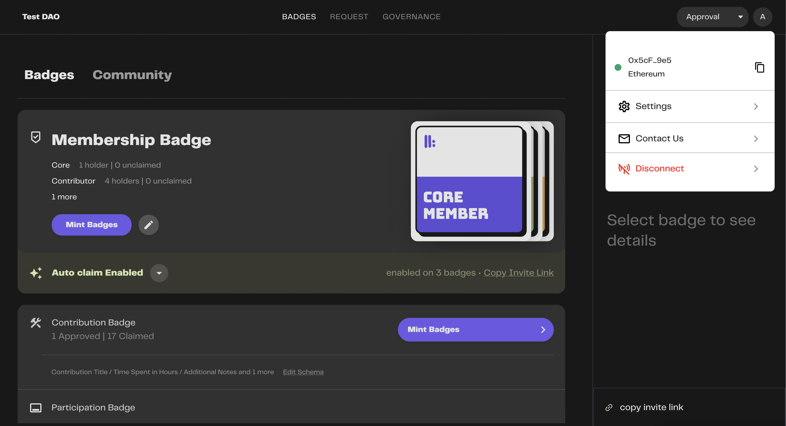
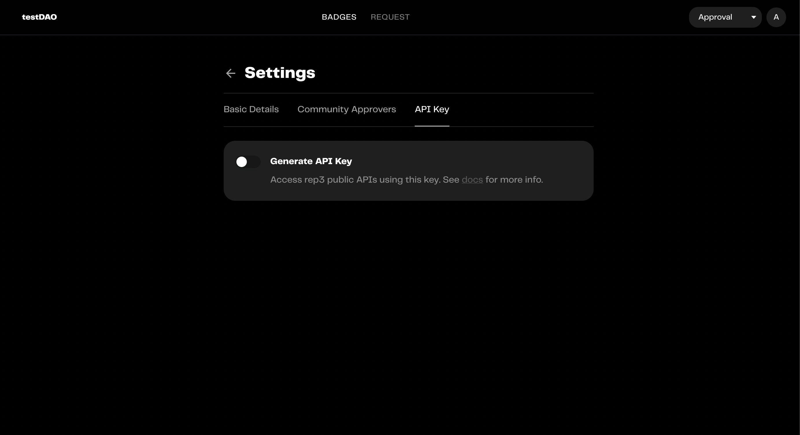
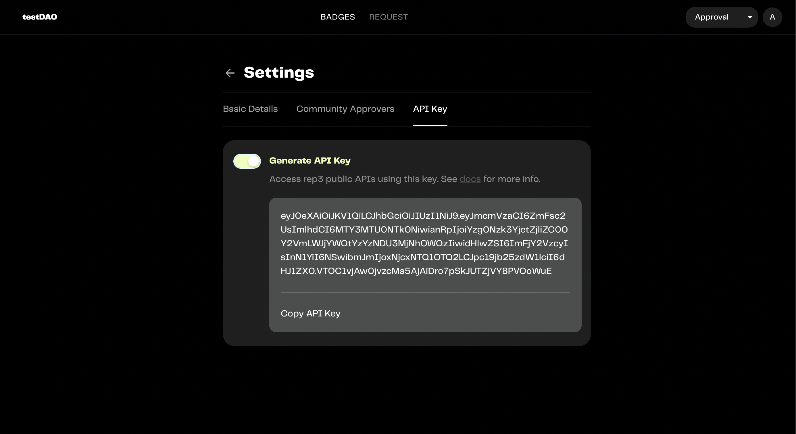

# Retrieving Your API Key
rep3's API suite lets you interact with the rep3 protocol from within your application.
 
Here's how to retrieve your API key.

#### 1. Go to settings.
On the top-right of your screen, click on your profile (a circular object with your initials) and select `Settings`.

#### 2. Generate your API key.
After switching to the Settings page, go to the `API Key` tab and toggle the `Generate API Key` button.

#### 3. And you're done!
Copy your API key and start interacting with [rep3's API suite](https://docs.rep3.gg/integration/rep3-API-suite).

