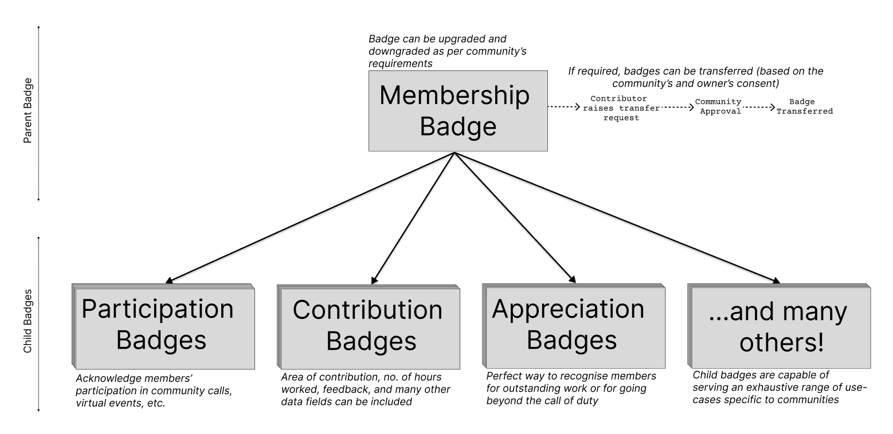

# Docs 📜
## What You'll Find Here

This documentation is designed to introduce rep3 and its products to users and developers of all skill levels. There are four main sections, each giving a brief overview of rep3, the protocol architecture, the protocol workflow and the DAO tool respectively.

Feel free to slide by our [Discord](discord.gg/xK2WXUv3VG) or our [Twitter](https"//twitter.com/rep3gg/") in case of queries or if you'd like to know more!

<i>rep3 protocol schema</i>

