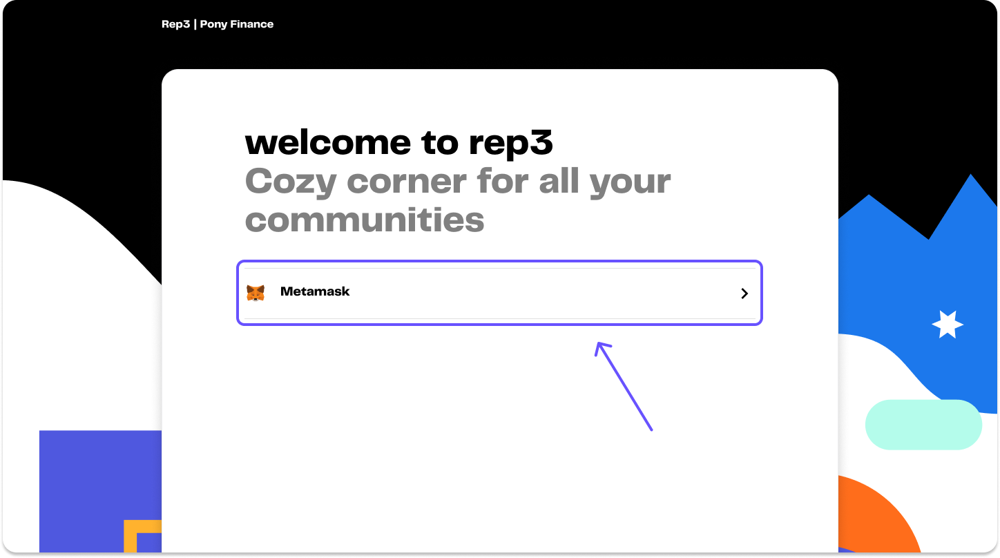
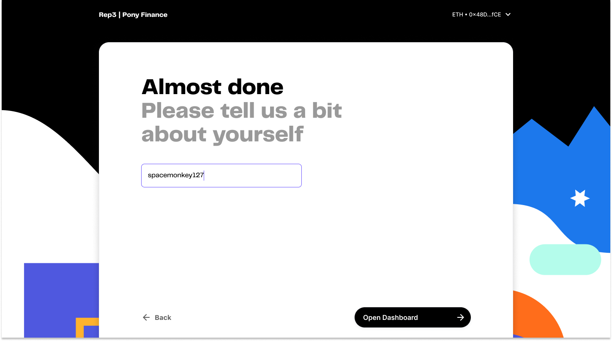
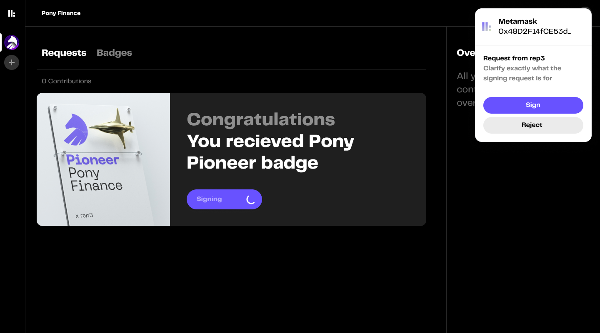
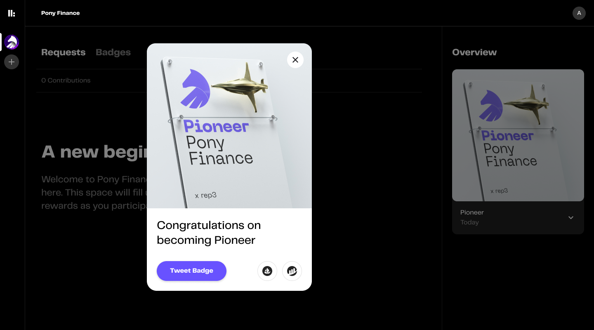

# 🤝 Claiming membership

After creating the memberships as specified in the previous guide. Community shares a invite link from dashboard for contributor/member onboarding. 

Next are the steps for a member in order to claim the membership via invite link.

1. Login via metamask

2. Enter name / alias

3. Dashboard should have the membership to be claimed. Proceed with signing the gasless transaction.

4. And voila! Congratulations of being a proud member of your favourite community.

